<!-- Generated by py/make_docs.py — do not edit by hand.
     The structure is read from the code; the prose lives in
     py/ips_docs_text.py. Edit those, then re-run the pipeline. -->

# Crosswalk to community standards

Integration into a shared knowledge graph such as the NFDI4Objects graph
depends on a consumer being able to reach our statements through
vocabularies they already understand, without loading LADO first. That is
the purpose of the subclass chain below: **every local class terminates in
a CIDOC CRM class**, and temporal structure is expressed in OWL-Time
rather than in local properties.

That claim is worth checking rather than asserting, because it is easy to
lose. `lado:DatingModel` originally sat beneath `prov:Plan` alone, which
is an external vocabulary but not CIDOC CRM — a CRM-only consumer could
see the datings and not the method that produced them. It now also sits
beneath `crm:E29_Design_or_Procedure`, the CRM class for a documented
procedure.

## Namespaces

| Prefix | Namespace |
|---|---|
| `samian` | `http://data.archaeology.link/data/samian/` |
| `lado` | `http://archaeology.link/ontology#` |
| `crm` | `http://www.cidoc-crm.org/cidoc-crm/` |
| `time` | `http://www.w3.org/2006/time#` |
| `prov` | `http://www.w3.org/ns/prov#` |
| `geo` | `http://www.opengis.net/ont/geosparql#` |
| `dcat` | `http://www.w3.org/ns/dcat#` |
| `dcterms` | `http://purl.org/dc/terms/` |
| `skos` | `http://www.w3.org/2004/02/skos/core#` |
| `crmdig` | `http://www.ics.forth.gr/isl/CRMdig/` |
| `pleiades` | `https://pleiades.stoa.org/places/` |
| `owl` | `http://www.w3.org/2002/07/owl#` |
| `xsd` | `http://www.w3.org/2001/XMLSchema#` |

## Subclass chain into CIDOC CRM

| Local class | Full chain to an external vocabulary |
|---|---|
| `lado:Location` | `lado:Location` → `crm:E53_Place` |
| `lado:DiscoverySite` | `lado:DiscoverySite` → `lado:Location` → `crm:E53_Place` |
| `lado:Findspot` | `lado:Findspot` → `lado:Location` → `crm:E53_Place` |
| `lado:DatedTimeSpan` | `lado:DatedTimeSpan` → `crm:E52_Time-Span` `lado:DatedTimeSpan` → `time:ProperInterval` |
| `lado:FindspotDating` | `lado:FindspotDating` → `lado:DatedTimeSpan` → `crm:E52_Time-Span` `lado:FindspotDating` → `lado:DatedTimeSpan` → `time:ProperInterval` |
| `lado:DatingInstant` | `lado:DatingInstant` → `crm:E52_Time-Span` `lado:DatingInstant` → `time:Instant` |
| `lado:DatingTimePosition` | `lado:DatingTimePosition` → `crm:E54_Dimension` `lado:DatingTimePosition` → `time:TimePosition` |
| `lado:YearScale` | `lado:YearScale` → `crm:E73_Information_Object` `lado:YearScale` → `time:TRS` |
| `lado:DatingModel` | `lado:DatingModel` → `crm:E29_Design_or_Procedure` `lado:DatingModel` → `prov:Plan` |
| `lado:DatingActivity` | `lado:DatingActivity` → `crmdig:D10_Software_Execution` → `crmdig:D7_Digital_Machine_Event` → `crm:E11_Modification` → `crm:E7_Activity` `lado:DatingActivity` → `crmdig:D10_Software_Execution` → `crmdig:D7_Digital_Machine_Event` → `crm:E65_Creation` → `crm:E7_Activity` `lado:DatingActivity` → `prov:Activity` |
| `lado:Figure` | `lado:Figure` → `crm:E36_Visual_Item` |
| `lado:PlotRow` | `lado:PlotRow` → `crm:E36_Visual_Item` |

Rows for classes reached through CRMdig continue past the extension into
CIDOC CRM itself, because the axioms that carry them there are restated
in the vocabulary file — see the note under `crmdig` below.

Each row gives the complete path, not just the immediate parent, because
the immediate parent is often another local class and hides where the
chain actually terminates. Where a class has two superclasses the chain
branches and both paths are listed: `lado:FindspotDating` reaches
`crm:E52_Time-Span` on one and `time:ProperInterval` on the other. A
CRM-only consumer sees a time-span, an OWL-Time consumer sees a proper
interval, both are true at once, and neither needs LADO to recognise the
node.

Relations between the entities use CRM properties directly in their
intended sense, rather than local equivalents:

| Relation | Property used |
|---|---|
| Findspot within its site | `crm:P89_falls_within` |
| Findspot to its dating | `crm:P4_has_time-span` |
| Outer bounds of a dating | `crm:P82a_begin_of_the_begin`, `crm:P82b_end_of_the_end` |

The last row exists because typing a node is not the same as making it
readable. Before it was added, a consumer working only in CIDOC CRM could
follow a findspot to its time-span — all 41 of them — and then find the
span empty, because the years hung solely behind OWL-Time. The two CRM
properties carry the interval bounds as `xsd:gYear`, so the dating can be
read without OWL-Time at all.

They are rounded to whole years, as `time:inXSDgYear` is. The exact
position stays in `time:numericPosition`; these two triples are the
bridge into CRM, not the authoritative figure.

```mermaid
flowchart BT
    lado_Location["lado:Location"]
    crm_E53_Place["crm:E53_Place"]
    lado_Location -->|subClassOf| crm_E53_Place
    lado_DiscoverySite["lado:DiscoverySite"]
    lado_DiscoverySite -->|subClassOf| lado_Location
    lado_Findspot["lado:Findspot"]
    lado_Findspot -->|subClassOf| lado_Location
    lado_DatedTimeSpan["lado:DatedTimeSpan"]
    crm_E52_Time_Span["crm:E52_Time-Span"]
    lado_DatedTimeSpan -->|subClassOf| crm_E52_Time_Span
    time_ProperInterval["time:ProperInterval"]
    lado_DatedTimeSpan -->|subClassOf| time_ProperInterval
    lado_FindspotDating["lado:FindspotDating"]
    lado_FindspotDating -->|subClassOf| lado_DatedTimeSpan
    lado_DatingInstant["lado:DatingInstant"]
    time_Instant["time:Instant"]
    lado_DatingInstant -->|subClassOf| time_Instant
    lado_DatingInstant -->|subClassOf| crm_E52_Time_Span
    lado_DatingTimePosition["lado:DatingTimePosition"]
    time_TimePosition["time:TimePosition"]
    lado_DatingTimePosition -->|subClassOf| time_TimePosition
    crm_E54_Dimension["crm:E54_Dimension"]
    lado_DatingTimePosition -->|subClassOf| crm_E54_Dimension
    lado_YearScale["lado:YearScale"]
    time_TRS["time:TRS"]
    lado_YearScale -->|subClassOf| time_TRS
    crm_E73_Information_Object["crm:E73_Information_Object"]
    lado_YearScale -->|subClassOf| crm_E73_Information_Object
    lado_DatingModel["lado:DatingModel"]
    prov_Plan["prov:Plan"]
    lado_DatingModel -->|subClassOf| prov_Plan
    crm_E29_Design_or_Procedure["crm:E29_Design_or_Procedure"]
    lado_DatingModel -->|subClassOf| crm_E29_Design_or_Procedure
    lado_DatingActivity["lado:DatingActivity"]
    prov_Activity["prov:Activity"]
    lado_DatingActivity -->|subClassOf| prov_Activity
    crmdig_D10_Software_Execution["crmdig:D10_Software_Execution"]
    lado_DatingActivity -->|subClassOf| crmdig_D10_Software_Execution
    lado_Figure["lado:Figure"]
    crm_E36_Visual_Item["crm:E36_Visual_Item"]
    lado_Figure -->|subClassOf| crm_E36_Visual_Item
    lado_PlotRow["lado:PlotRow"]
    lado_PlotRow -->|subClassOf| crm_E36_Visual_Item
    class lado_DatedTimeSpan,lado_DatingActivity,lado_DatingInstant,lado_DatingModel,lado_DatingTimePosition,lado_DiscoverySite,lado_Figure,lado_Findspot,lado_FindspotDating,lado_Location,lado_PlotRow,lado_YearScale local
    class crm_E29_Design_or_Procedure,crm_E36_Visual_Item,crm_E52_Time_Span,crm_E53_Place,crm_E54_Dimension,crm_E73_Information_Object crm
    class time_Instant,time_ProperInterval,time_TRS,time_TimePosition time
    class crmdig_D10_Software_Execution,prov_Activity,prov_Plan ext

    classDef local fill:#e8eef7,stroke:#4a6b96,stroke-width:1px,color:#12181f
    classDef crm fill:#efe7f5,stroke:#7a5a96,stroke-width:1px,color:#12181f
    classDef time fill:#e3f2ec,stroke:#3f8a70,stroke-width:1px,color:#12181f
    classDef ext fill:#f3f1ec,stroke:#8a857a,stroke-width:1px,color:#12181f
    classDef io fill:#faf3e3,stroke:#a8872e,stroke-width:1px,color:#12181f
```

*Every path ends in an external vocabulary. That is the whole claim of the crosswalk.*

[JPG](https://raw.githubusercontent.com/leiza-rse/IPSDatedSites/main/img/diagrams/hierarchy.jpg) · [SVG](https://raw.githubusercontent.com/leiza-rse/IPSDatedSites/main/img/diagrams/hierarchy.svg) · [Mermaid source](https://github.com/leiza-rse/IPSDatedSites/blob/main/docs/diagrams/hierarchy.mmd) — generated, do not edit.

## Per-vocabulary notes

### `crm` — `http://www.cidoc-crm.org/cidoc-crm/`

CIDOC CRM is the integration layer. Every class minted here reaches a CRM class through rdfs:subClassOf, so a consumer that understands only CRM still sees places, time-spans and visual items without needing to load the LADO vocabulary. Findspots attach to their sites with crm:P89_falls_within and to their datings with crm:P4_has_time-span, both of which are standard CRM properties used in their intended sense.

### `time` — `http://www.w3.org/2006/time#`

OWL-Time carries the temporal semantics. Interval boundaries are time:Instant nodes reached through time:hasBeginning and time:hasEnd. Each instant carries a time:TimePosition with a decimal time:numericPosition, because the computed boundaries are not whole years — forty of forty-one rows have a fractional part, and rounding them away would discard exactly the precision the model produces. A rounded time:inXSDgYear is supplied alongside for consumers that read calendar years only. Note that time:intervalStarts and time:intervalFinishes are NOT used: they relate an interval to another interval, not to an instant, and an earlier version of this export misused them in that way.

### `prov` — `http://www.w3.org/ns/prov#`

PROV-O records how the intervals came to exist. Each dating is generated by a prov:Activity whose qualified association names a prov:Plan holding the model parameters, so the parameters are stated once rather than repeated on every row. Note the namespace: the published discovery-site file (2019 release) binds prov: to http://www.w3.org/ns/prov-o/, which is not the PROV-O namespace and leaves its six provenance predicates pointing at terms that do not exist. This export uses http://www.w3.org/ns/prov# and does not reproduce that error.

### `geo` — `http://www.opengis.net/ont/geosparql#`

GeoSPARQL is referenced rather than asserted. The published discovery-site dataset already carries geo:hasGeometry with a geo:wktLiteral for these places, so this export emits no geometry by default. The --emit-geometry switch adds the IPS coordinates under a separate geometry node for anyone who wants to compare the two, but the default is silence rather than a second, competing position for the same place.

### `dcat` — `http://www.w3.org/ns/dcat#`

DCAT describes the export as a dataset. Because the time-span URIs are deliberately not versioned, their values change when the source data change; the dated dataset node is therefore what a reader cites when they need a fixed state.

### `dcterms` — `http://purl.org/dc/terms/`

Dublin Core Terms supplies title, source, creation and issue dates on the dataset node.

### `skos` — `http://www.w3.org/2004/02/skos/core#`

SKOS is used narrowly: skos:notation retains the readable slug of each findspot alongside its hashed URI, so that a broken link can still be diagnosed, and skos:closeMatch relates the local year scale to the Gregorian reference system.

### `samian` — `http://data.archaeology.link/data/samian/`

The namespace for resources under our own control, at data.archaeology.link. Discovery-site nodes in this namespace are already published and are only referenced here; findspots, datings, plot rows, figures and the model are new.

### `lado` — `http://archaeology.link/ontology#`

The local ontology, extended here with the classes and properties that CIDOC CRM and OWL-Time do not supply — chiefly the separation between an archaeological dating and its presentation, and the quantities specific to this statistical model.

### `pleiades` — `https://pleiades.stoa.org/places/`

Pleiades identifiers are carried as an add-on where they exist, which is for 14 of 41 rows. A caveat: the source database stores them as floating-point values, so the identifiers arrive with a trailing '.0'. This export casts them to integers. The published discovery-site file does not, which is why all 280 of its Pleiades links are unreachable.

### `owl` — `http://www.w3.org/2002/07/owl#`

Used for the ontology declaration and for version information.

### `xsd` — `http://www.w3.org/2001/XMLSchema#`

Supplies the literal datatypes.

## Which instances carry a CIDOC CRM type

Every class in this vocabulary reaches CIDOC CRM, but that is a weaker
statement than it sounds, because not every node in the graph is an
instance of one of those classes. The honest position:

| Group | CRM type | Why |
|---|---|---|
| Findspots, sites, datings, plot rows, figures, activities, the model | yes | the substance of the export |
| The export and the bundle themselves | yes, via `crmdig:D1_Digital_Object` | reaching `crm:E73_Information_Object` |
| The exporting software | yes, via `crmdig:D14_Software` | likewise |
| `time:Instant`, `time:TimePosition` | no | CIDOC CRM has no class for an interval endpoint as a node; it expresses boundaries as properties of the time-span, which is why `crm:P82a_begin_of_the_begin` and `crm:P82b_end_of_the_end` are supplied |
| `time:TRS` | no | a temporal reference system has no CRM counterpart |
| `prov:Association` blank nodes | no | reification of an association, structural rather than a thing in the world |
| `owl:Class`, `owl:DatatypeProperty`, `owl:ObjectProperty`, `owl:Ontology` | no | the vocabulary itself, not data described by it |

Forcing the last four groups into CIDOC CRM would be worse modelling than
leaving them alone: a reference system is not an `E55 Type`, and an
`owl:Class` is not an `E1 CRM Entity` in any useful sense. What matters
is not that every node carries a CRM type but that a CRM-only consumer
can reach everything it needs, which is what the property bridge above
secures.

## Every instance reaches CIDOC CRM

The rule this export holds to is stricter than it first appears: **every
instance of an application class carries a CIDOC CRM type**, whether
directly or through an extension that is itself anchored in CRM. It is
not enough for the local classes to have CRM superclasses on paper — the
instances have to arrive there.

Properties are exempt. Where an OWL-Time or PROV-O property expresses the
relation better, it is used; only classes are held to the rule.

Two consequences shaped the model. Interval boundaries became
`lado:DatingInstant` and `lado:DatingTimePosition` rather than bare
`time:Instant` and `time:TimePosition` nodes, so that they could be
anchored in `crm:E52_Time-Span` and `crm:E54_Dimension` without asserting
anything about OWL-Time in general. And the PROV qualified-association
pattern was dropped: a reification node is not a thing in the world and
CIDOC CRM has no class for one. The two statements it carried are now
made directly, with `prov:used` and `crm:P33_used_specific_technique`,
which say the same and are valid in both vocabularies.

The rule is checked on every run rather than assumed, because a new class
without a CRM superclass breaks nothing visible and would otherwise go
unnoticed. The bundle builder counts the instances and refuses to write a
file that contains an unanchored one.

## Notes for knowledge-graph integration

Three properties of this export matter for anyone merging it:

**It is additive over published data.** The only statements made about
`samian:loc_ds_*` nodes are an `rdfs:label` and, where present, the
ancient name and Pleiades identifier. No published node is re-typed, and
no geometry is asserted for a place that already has one. A merge cannot
therefore contradict the discovery-site dataset.

**Absence is explicit.** `lado:undefinedMeasure` distinguishes a value
that was computed and found not to exist from one that nobody has
calculated. Without it, the open-world assumption would flatten the two.

**Presentation is separable.** Everything that exists only because a
figure was drawn hangs off `lado:PlotRow` and `lado:Figure`. A consumer
interested solely in the archaeology can ignore both classes and lose
nothing, and — more importantly — will not mistake a drawing convention
for a dating claim.

One caveat inherited from the published data rather than introduced here:
`loc_discoverysite_1.ttl` (2019 release) binds `prov:` to `http://www.w3.org/ns/prov-o/`,
which is not the PROV-O namespace. All six of its provenance predicates
consequently denote nothing. This export uses the correct namespace and
does not reproduce the error, which means the two files disagree about
what `prov:wasGeneratedBy` denotes until the published file is corrected.
