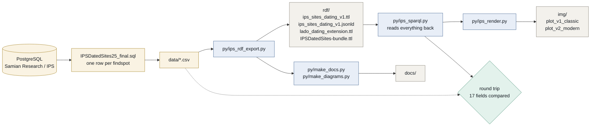

<!-- Generated by py/make_docs.py — do not edit by hand.
     The structure is read from the code; the prose lives in
     py/ips_docs_text.py. Edit those, then re-run the pipeline. -->

# Findspot datings as linked data

How the dating of archaeological findspots by samian potters' stamps is
modelled as RDF, and why each decision was taken.

The source is a single query over the Samian Research / IPS database, one
row per findspot. The export turns each row into a small graph built on
CIDOC CRM, OWL-Time, PROV-O and the local LADO vocabulary, and a companion
step reconstructs the published figure from that graph alone using SPARQL.
That reconstruction is the test of the modelling: if a quantity the figure
needs is missing from the graph, the round trip fails rather than quietly
substituting a default.

## Pages

| Page | Contents |
|---|---|
| [Model](model.md) | The three layers, URI strategy, and the treatment of missing values |
| [Vocabulary](vocabulary.md) | The 12 classes and 44 properties minted here |
| [Crosswalk](crosswalk.md) | Mapping to CIDOC CRM, OWL-Time, GeoSPARQL, PROV-O, DCAT and SKOS |
| [Statistics](statistics.md) | The formulas behind the intervals, as implemented in SQL |
| [Queries](queries.md) | The SPARQL used to rebuild the figure, and the round-trip check |
| [Bundle](bundle.md) | The standalone file for a triplestore, and why the crosswalk is materialised |
| [Open questions](open-questions.md) | What remains unresolved and why it matters |




*The pipeline. Everything after the export reads from the graph, never from the CSV — apart from the round-trip check, which compares the two.*

<sub>[JPG](https://raw.githubusercontent.com/leiza-rse/IPSDatedSites/main/img/diagrams/architecture.jpg) · [SVG](https://raw.githubusercontent.com/leiza-rse/IPSDatedSites/main/img/diagrams/architecture.svg) · [Mermaid source](https://github.com/leiza-rse/IPSDatedSites/blob/main/docs/diagrams/architecture.mmd) — generated, do not edit.</sub>

## The shape of it in one paragraph

A findspot (`lado:Findspot`, beneath `crm:E53_Place`) falls within a
published discovery site. Its dating (`lado:FindspotDating`, beneath both
`crm:E52_Time-Span` and `time:ProperInterval`) hangs off it and carries the
computed interval together with every quantity needed to recompute that
interval. The presentation layer sits apart: a `lado:PlotRow` renders the
dating and carries the whiskers, which the method documentation classes as
visual only. Provenance runs through PROV-O, with the model parameters
stated once on a `prov:Plan` rather than repeated on each row.

## Regenerating

These pages are generated. Running the pipeline rewrites them:

```
python py/main.py
```

Structure comes from the code itself — classes, properties, namespaces,
figure constants and queries are read at generation time. The English
prose lives in `py/ips_docs_text.py`, which also supplies the English
`rdfs:comment` on every term in the ontology, so a definition cannot be
correct in the documentation and stale in the RDF. The generator refuses
to run if a class or property in the code has no entry there.

*Generated 2026-07-23 from 12 classes, 3 object
properties and 41 datatype properties.*
